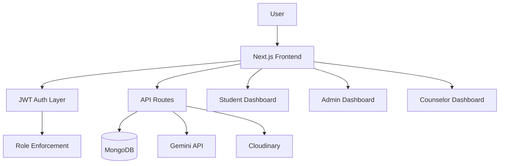

# EduPath

EduPath is a full-stack, role-based student guidance platform for career exploration, psychometric assessment, colleges, scholarships, competitive exams, and counseling workflows.

It is implemented with Next.js App Router, React, TypeScript, MongoDB, and modular API architecture.

---

## 1) Executive Summary

EduPath is designed to centralize student growth decisions in one place:
- discover pathways after school,
- evaluate strengths through psychometric data,
- track scholarships and exam opportunities,
- connect with counselors,
- manage progress in dashboard-first workflows.

The platform now includes dedicated dashboard experiences for Student, Admin, and Counselor roles, each with role-based access protection and targeted API layers.

---

## 2) Core Value Delivered

- Career decision support with structured guidance modules.
- Psychometric-based insights and recommendation flows.
- Full scholarship/exam/college discovery ecosystem.
- Counselor session support and counselor workload visibility.
- Admin-level governance over users, feedback, and platform overview.
- AI assistant with multilingual support (English, Hindi, Dogri).

---

## 3) Role-Based Product Capabilities

### Student (`/studentDashboard`)
Implemented modules:
- Dashboard
- Profile
- Progress Tracker
- Psychometric Test
- Government College
- Short Listed College
- Career Option
- Counseling Booking
- Competitive Exams
- Scholarships
- Feedback & Suggestions

### Admin (`/adminDashboard`)
Fully functional tabs:
- Overview
- Users (search, role update, active/inactive toggle)
- Feedback (status filtering and moderation)
- Content (notification navigation + content data links)

Student-parity tabs currently intentionally available as placeholders:
- Profile
- Progress Tracker
- Psychometric Test
- Government College
- Short Listed College
- Career Option
- Counseling Booking
- Competitive Exams
- Scholarships

Click behavior for placeholder tabs:
- dedicated panel with clear **Under Development** status.

### Counselor (`/counselorDashboard`)
Fully functional tabs:
- Overview (daily metrics, profile snapshot, recent sessions)
- Sessions (status filter and tabular session management view)
- Students (insight cards derived from session history)
- Messages (initial communication module)

Student-parity tabs currently intentionally available as placeholders:
- Profile
- Progress Tracker
- Psychometric Test
- Government College
- Short Listed College
- Career Option
- Counseling Booking
- Competitive Exams
- Scholarships
- Feedback & Suggestions

Click behavior for placeholder tabs:
- dedicated panel with clear **Under Development** status.

---

## 4) Access Control, Security, and Routing

### Route-Level Role Protection
- `src/app/adminDashboard/layout.tsx`
  - only allows authenticated `admin`
  - redirects unauthenticated users to `/login`
  - redirects non-admin users to `/studentDashboard`

- `src/app/counselorDashboard/layout.tsx`
  - only allows authenticated `counselor`
  - redirects unauthenticated users to `/login`
  - redirects `admin` to `/adminDashboard`
  - redirects non-counselor users to `/studentDashboard`

### API-Level Role Protection
- `src/app/lib/adminAuth.ts` → `requireAdmin(request)`
  - returns `401` for missing/invalid authentication
  - returns `403` for non-admin role

- `src/app/lib/counselorAuth.ts` → `requireCounselor(request)`
  - returns `401` for missing/invalid authentication
  - returns `403` for non-counselor role

### Login Redirect Logic
After successful authentication:
- `admin` → `/adminDashboard`
- `counselor` → `/counselorDashboard`
- all other roles → `/studentDashboard`

### Global Layout Behavior
`Navbar` and `Footer` are hidden on dashboard/auth-focused routes:
- `/studentDashboard`
- `/adminDashboard/*`
- `/counselorDashboard/*`
- `/login`
- `/register`

---

## 5) Admin Module: Functional Breakdown

### `GET /api/admin/overview`
Returns:
- user counters by role,
- content counters (college/career/exam/scholarship),
- feedback counters,
- recent users,
- recent feedback.

### `GET /api/admin/users?q=`
Returns searchable user list by name/email.

### `PATCH /api/admin/users`
Supports:
- role updates (`student`, `counselor`, `admin`),
- account activation toggling (`isActive`).

Safety rule implemented:
- an admin cannot remove their own admin role.

### `GET /api/admin/feedback?status=`
Returns feedback list with optional status filtering.

### `PATCH /api/admin/feedback`
Updates feedback status:
- `Pending`
- `Reviewed`
- `Responded`

---

## 6) Counselor Module: Functional Breakdown

### `GET /api/counselor/overview`
Returns:
- counselor profile snapshot,
- session counters (today/upcoming/completed),
- total guided students,
- recent sessions.

### `GET /api/counselor/sessions?status=`
Returns status-filtered sessions with:
- student name and email,
- session type,
- schedule,
- duration,
- meeting mode/location metadata.

---

## 7) Student Module: Functional Breakdown

Student-facing product areas include:
- personal profile and progress tracking,
- psychometric assessment and analytics,
- careers/colleges/exams/scholarships exploration,
- counselor booking flow,
- feedback and suggestions.

Related aggregate API:
- `GET /api/studentDashboard`

---

## 8) AI Chat Assistant

The chatbot is globally mounted and available across the application.

Implemented behavior:
- floating bot launcher with modern panel UI,
- quick prompts,
- voice input integration,
- language switching: English → Hindi → Dogri,
- response feedback (helpful / not helpful),
- improved backend error handling and response parsing.

Primary route:
- `POST /api/chatbot`

---

## 9) Technology Stack

### Frontend
- Next.js 15 (App Router)
- React 19
- TypeScript
- Tailwind CSS 4
- Radix UI
- Lucide React icons

### Backend
- Next.js API Routes
- JWT cookie auth (`auth-token`)
- Mongoose (MongoDB ODM)

### Integrations
- MongoDB
- Cloudinary (uploads)
- Gemini API (assistant responses)

### Tooling
- ESLint
- Turbopack (`dev` and `build` scripts)

---

## 10) Architecture View



---

## 11) API Route Catalog

### Authentication
- `/api/auth/register`
- `/api/auth/login`
- `/api/auth/logout`
- `/api/auth/me`
- `/api/auth/forgot-password`

### Admin
- `/api/admin/overview`
- `/api/admin/users`
- `/api/admin/feedback`

### Counselor
- `/api/counselor/overview`
- `/api/counselor/sessions`
- `/api/counselors`
- `/api/counselors/[id]`
- `/api/counselors/[id]/slots`
- `/api/counselors/book`

### Assessments and Psychometric
- `/api/assessments`
- `/api/assessments/[id]`
- `/api/assessments/[id]/submit`
- `/api/psychometric`
- `/api/psychometric/questions`
- `/api/psychometric/analytics`
- `/api/quiz/submit`

### Domain Content
- `/api/careers`
- `/api/careers/[id]`
- `/api/careers/seed`
- `/api/exams`
- `/api/exams/suggestions`
- `/api/scholarships`
- `/api/scholarships/suggestions`
- `/api/colleges`
- `/api/colleges/[id]`
- `/api/institutes`

### User Scope
- `/api/user/profile`
- `/api/user/assessments`
- `/api/user/sessions`
- `/api/user/savedCareers`
- `/api/user/savedExams`
- `/api/user/savedScholarships`
- `/api/user/shortlistedColleges`

### Other
- `/api/feedback`
- `/api/progress`
- `/api/studentDashboard`
- `/api/chatbot`

---

## 12) UI Route Map

### Public Routes
- `/`
- `/about`
- `/careerAssessment`
- `/governmentCollege`
- `/competitiveExams`
- `/studyResources`
- `/quiz`
- `/login`
- `/register`
- `/passwordReset`

### Protected Dashboard Routes
- `/studentDashboard`
- `/adminDashboard`
- `/counselorDashboard`

### Notification Routes
- `/notifications/scholarship`
- `/notifications/examDate`
- `/notifications/counselingSchedule`

---

## 13) Data Model Inventory

Primary models:
- `User`
- `Assessment`
- `AssessmentResult`
- `Career`
- `College`
- `Counselor`
- `CounselingSession`
- `Exam`
- `Scholarship`
- `Feedback`
- `Progress`
- `Institute`
- `PsychometricQuestion`
- `PsychometricAttempt`
- `SavedCareer`

---

## 14) Key Directory Structure

```text
src/app/
├── adminDashboard/
├── counselorDashboard/
├── studentDashboard/
├── api/
│   ├── admin/
│   ├── counselor/
│   ├── auth/
│   ├── assessments/
│   ├── psychometric/
│   ├── careers/
│   ├── colleges/
│   ├── counselors/
│   ├── exams/
│   ├── scholarships/
│   ├── feedback/
│   ├── progress/
│   ├── studentDashboard/
│   └── user/
├── components/
├── hooks/
├── lib/
│   ├── auth.ts
│   ├── adminAuth.ts
│   ├── counselorAuth.ts
│   └── mongoose.ts
└── models/
```

---

## 15) Environment Variables

Create `.env.local`:

```env
MONGODB_URI=
JWT_SECRET=
NEXTAUTH_SECRET=
NEXTAUTH_URL=http://localhost:3000

CLOUDINARY_CLOUD_NAME=
CLOUDINARY_API_KEY=
CLOUDINARY_API_SECRET=

GEMINI_API_KEY=
```

Security best practices:
- never commit secrets,
- rotate exposed keys immediately,
- use managed secret storage in deployment.

---

## 16) Local Development Setup

1. Install dependencies
```bash
npm install
```

2. Create `.env.local` and add required values.

3. (Optional) Seed data
```bash
npx ts-node scripts/seedPsychometricQuestions.ts
npx ts-node scripts/seedCareers.ts
npx ts-node scripts/seedCompetitiveExams.ts
npx ts-node scripts/seedShortlistedColleges.ts
```

4. Run development server
```bash
npm run dev
```

5. Open application
- `http://localhost:3000`

---

## 17) Build and Run

Available scripts:
- `npm run dev`
- `npm run build`
- `npm run start`
- `npm run lint`

Current build configuration in `next.config.ts`:
- `typescript.ignoreBuildErrors = true`
- `eslint.ignoreDuringBuilds = true`

This is useful for fast iteration but should be tightened for production-grade CI.

---

## 18) Professional Status Matrix

| Module Area | Status | Remarks |
|---|---|---|
| Student Dashboard | Implemented | Core student workflow is live |
| Admin Dashboard (Overview/Users/Feedback/Content) | Implemented | Protected by admin role checks |
| Admin Student-Parity Tabs | Under Development | Present in sidebar with clear placeholder state |
| Counselor Dashboard (Overview/Sessions/Students/Messages) | Implemented | Protected by counselor role checks |
| Counselor Student-Parity Tabs | Under Development | Present in sidebar with clear placeholder state |
| Role-based route guards | Implemented | Layout-level and API-level enforcement |
| Multilingual chatbot | Implemented | English/Hindi/Dogri support |
| Notifications pages | Implemented | Scholarship, exam date, counseling schedule |

---

## 19) Recommended Next Sprint

- convert placeholder tabs into full production modules,
- remove build-skip settings and enforce strict lint/type checks,
- add unit/integration tests for protected admin/counselor routes,
- introduce audit logging for role/feedback updates,
- add CI/CD quality gates and deployment checks.

---

## 20) Maintainer and Ownership

- Owner: `ashwanik0777`
- Project: `EduPath`

---

## 21) License

Add a license file (for example MIT) based on your distribution model.
