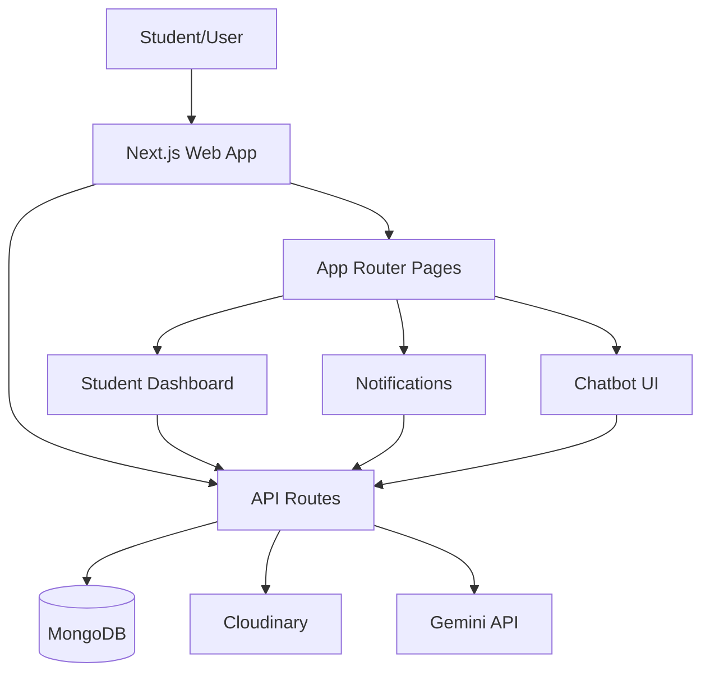
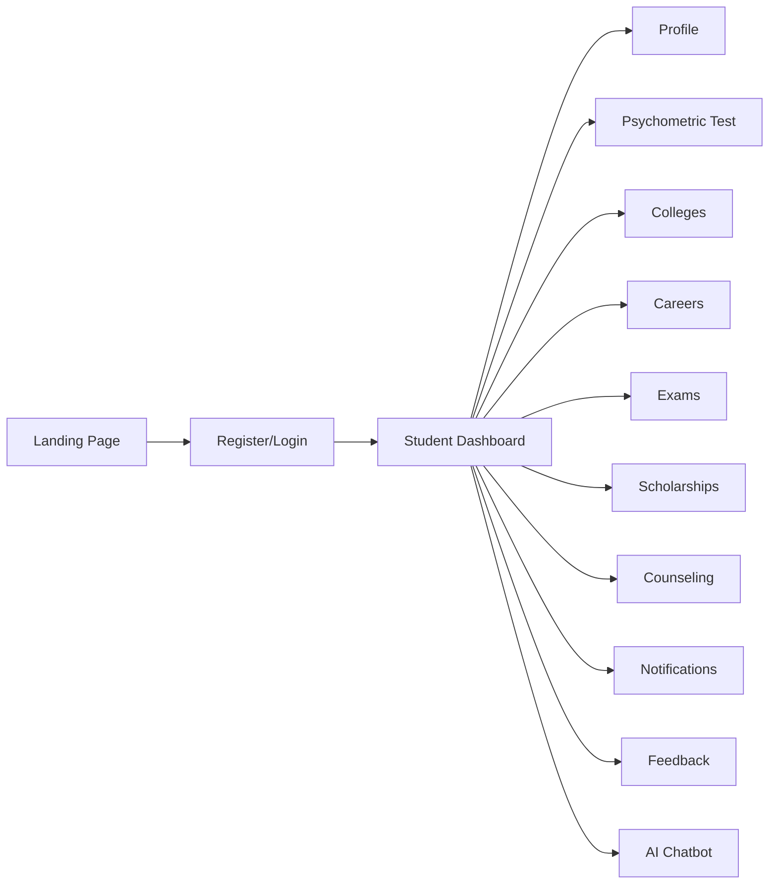
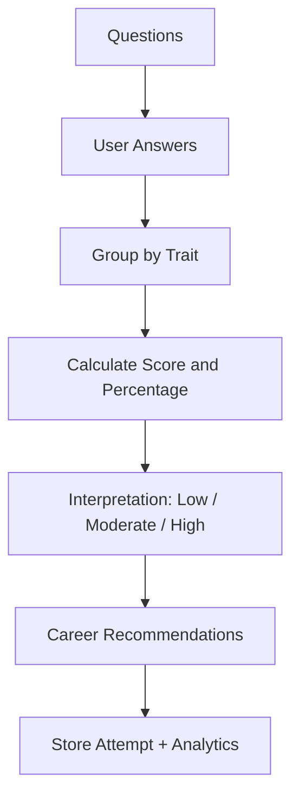
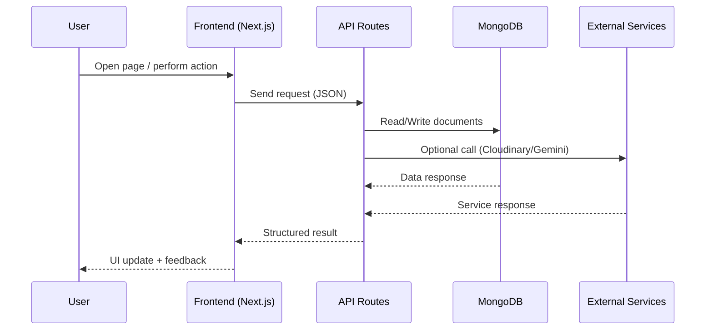

# EduPath

EduPath is a full-stack student guidance platform for career planning, psychometric assessment, colleges, scholarships, exams, counseling, and progress tracking.

It is built with Next.js App Router, React, TypeScript, MongoDB, and modular API routes. The goal is to give students (especially in Jammu & Kashmir context) one place for planning and decision support.

---

## 1) What this project solves

- Helps students discover career options based on personality and interests.
- Provides scholarship and exam updates with filters and tracking.
- Supports counseling session discovery/booking workflows.
- Gives an interactive dashboard with profile, progress, and saved items.
- Includes an AI chatbot assistant for guidance and quick navigation help.

---

## 2) Core features

- Authentication (register, login, logout, current user).
- Student dashboard with modules:
  - Profile
  - Psychometric assessment
  - Government colleges
  - Careers
  - Exams
  - Scholarships
  - Counseling
  - Progress tracking
  - Feedback
- Notifications center:
  - Scholarship updates
  - Exam dates
  - Counseling schedules
- AI chatbot with multilingual support flow (English/Hindi/Dogri), intent handling, and feedback endpoint.
- Media upload support for feedback screenshots via Cloudinary.

---

## 3) Tech stack

### Frontend
- Next.js 15 (App Router)
- React 19
- TypeScript
- Tailwind CSS 4
- Radix UI + custom UI components
- React Hook Form + Zod
- Lucide icons

### Backend
- Next.js API routes (server functions)
- JWT-based auth helpers
- Mongoose models

### Data & integrations
- MongoDB
- Cloudinary (uploads)
- Gemini API (chatbot)

### Tooling
- ESLint
- Turbopack for dev/build

---

## 4) High-level architecture



---

## 5) User journey flow



---

## 6) Main folders and purpose

```text
edu-path/
├── public/                          # static assets, quiz images, logos
├── src/app/
│   ├── api/                         # all backend route handlers
│   ├── components/                  # shared UI + feature components
│   ├── models/                      # mongoose schemas
│   ├── lib/                         # auth, db connection, utils
│   ├── hooks/                       # custom react hooks
│   ├── notifications/               # scholarship/exam/counseling notification pages
│   ├── studentDashboard/            # main dashboard page
│   ├── login/register/passwordReset # auth pages
│   └── layout.tsx                   # root layout
├── scripts/                         # data seed scripts
├── package.json
└── README.md
```

---

## 7) API route map

### Auth
- `/api/auth/register`
- `/api/auth/login`
- `/api/auth/logout`
- `/api/auth/me`
- `/api/auth/forgot-password`

### Assessments / psychometric
- `/api/assessments`
- `/api/assessments/[id]`
- `/api/assessments/[id]/submit`
- `/api/psychometric`
- `/api/psychometric/questions`
- `/api/psychometric/analytics`
- `/api/quiz/submit`

### Career, exam, scholarship
- `/api/careers`
- `/api/careers/[id]`
- `/api/careers/seed`
- `/api/exams`
- `/api/exams/suggestions`
- `/api/scholarships`
- `/api/scholarships/suggestions`

### Colleges / institutes
- `/api/colleges`
- `/api/colleges/[id]`
- `/api/institutes`

### Counselors
- `/api/counselors`
- `/api/counselors/[id]`
- `/api/counselors/[id]/slots`
- `/api/counselors/book`

### User data
- `/api/user/profile`
- `/api/user/assessments`
- `/api/user/sessions`
- `/api/user/savedCareers`
- `/api/user/savedExams`
- `/api/user/savedScholarships`
- `/api/user/shortlistedColleges`

### Other
- `/api/feedback`
- `/api/progress`
- `/api/studentDashboard`
- `/api/chatbot`

---

## 8) Database models

Main models used in this project:

- `User`
- `Assessment`
- `AssessmentResult`
- `PsychometricQuestion`
- `PsychometricAttempt`
- `Progress`
- `College`
- `Institute`
- `Career`
- `SavedCareer`
- `Exam`
- `Scholarship`
- `Counselor`
- `CounselingSession`
- `Feedback`

---

## 9) Notifications module (dynamic pages)

Base route: `/notifications`

Pages:
- `/notifications/scholarship`
- `/notifications/examDate`
- `/notifications/counselingSchedule`

These pages are designed as interactive modules with:
- Search and filter support
- Status/priority views
- Action buttons (apply/join/reminder type actions)
- Dynamic state-based rendering patterns

---

## 10) Chatbot module

Chatbot is integrated as a global assistant component and uses backend route processing.

Key behavior:
- Floating bot icon and expandable chat panel
- Message handling via `/api/chatbot`
- Language context support
- Feedback endpoint support for response quality loop

> Important: Keep your Gemini key only in env files. Never commit secrets.

---

## 11) Psychometric scoring flow

The psychometric engine uses OCEAN-style category scoring:
- Read answers by trait category
- Compute raw score and percentage
- Generate interpretation bands
- Map top traits to recommendation blocks



---

## 12) Environment variables

Create `.env` (or `.env.local`) and set values:

```env
MONGODB_URI=
NEXTAUTH_SECRET=
JWT_SECRET=
NEXTAUTH_URL=http://localhost:3000

CLOUDINARY_CLOUD_NAME=
CLOUDINARY_API_KEY=
CLOUDINARY_API_SECRET=

GEMINI_API_KEY=
```

Security notes:
- Do not hardcode secrets in source files.
- Do not push real credentials to GitHub.
- Rotate keys immediately if exposed.

---

## 13) Local setup (step-by-step)

1. Install dependencies

```bash
npm install
```

2. Configure environment variables in `.env` or `.env.local`.

3. Seed optional data

```bash
npx ts-node scripts/seedPsychometricQuestions.ts
npx ts-node scripts/seedCareers.ts
npx ts-node scripts/seedCompetitiveExams.ts
npx ts-node scripts/seedShortlistedColleges.ts
```

4. Start development server

```bash
npm run dev
```

5. Open app

`http://localhost:3000`

---

## 14) Build and production

### Build

```bash
npm run build
```

### Start production server

```bash
npm run start
```

Current project config includes build-time skipping for TypeScript/ESLint checks in Next config.
For production quality, it is recommended to remove that skip later and fix all lint/type errors.

---

## 15) Scripts

From `package.json`:
- `npm run dev` → start dev server
- `npm run build` → production build
- `npm run start` → run built app
- `npm run lint` → lint project

---

## 16) Common troubleshooting

### A) `location is not defined` on build
- Cause: browser-only API used during server prerender.
- Fix: move browser-only calls into client-safe flow (`useEffect`) or use Next router APIs.

### B) Hook order changed warning
- Cause: hooks called conditionally.
- Fix: keep all hooks at top-level before any early return.

### C) Gemini API error
- Verify `GEMINI_API_KEY`.
- Restart server after env change.
- Check route logs for API response status and body.

### D) Mongo connection issues
- Verify `MONGODB_URI` and network access for Atlas IP allowlist.

---

## 17) Future improvement suggestions

- Add role-based auth (student/admin/counselor).
- Add background jobs for exam/scholarship reminders.
- Add notification persistence and read/unread tracking.
- Add complete i18n framework for multilingual UI.
- Add integration tests for core API routes.
- Remove build skip flags and enforce strict CI checks.

---

## 18) Maintainers

Project owner: `ashwanik0777`

Repository: `EduPath`

---

## 19) License

Add your preferred license file (for example MIT) if you want open-source distribution.

---

## 20) Executive project report (professional summary)

### Project name
EduPath

### Project type
Full-stack web platform for student career guidance and decision support.

### Target users
- School students (mainly class 9–12)
- College aspirants
- Early career learners
- Parents/counselors (as supporting users)

### Primary outcomes
- Better career decision quality through psychometric insights.
- Better awareness of scholarships and exam deadlines.
- Better support via counseling and chatbot assistance.

### Current status
- Functional MVP+ with multi-module dashboard, notifications, and APIs.
- Database-backed architecture with scalable route-based backend.
- UI modules exist for both static and dynamic interaction flows.

---

## 21) Complete page map (UI routes)

| Route | Purpose |
|---|---|
| `/` | Landing page |
| `/about` | About platform |
| `/careerAssessment` | Career assessment information/view |
| `/competitiveExams` | Competitive exams page |
| `/governmentCollege` | Government colleges view |
| `/studyResources` | Study resource content |
| `/quiz` | Quiz page |
| `/login` | User login |
| `/register` | User registration |
| `/passwordReset` | Password reset flow |
| `/studentDashboard` | Student dashboard (main authenticated area) |
| `/adminDashboard` | Admin dashboard page |
| `/notifications` | Notifications landing/redirect |
| `/notifications/scholarship` | Scholarship notifications |
| `/notifications/examDate` | Exam date notifications |
| `/notifications/counselingSchedule` | Counseling schedule notifications |

---

## 22) Navigation information architecture

Navbar includes major entry points:
- Home
- About
- Career Assessment
- Government College
- Study Resources
- Notifications
  - Scholarship
  - Exam Date
  - Counseling Schedule

This menu architecture ensures students can move from discovery (`home`, `about`) to action (`assessment`, `notifications`) quickly.

---

## 23) Detailed backend module inventory

### Auth APIs
- Register user account
- Login and token generation
- Logout and session/token cleanup
- Get current authenticated user
- Forgot-password initiation flow

### Assessment APIs
- Assessment listing and retrieval
- Assessment submission
- Assessment by ID operations

### Psychometric APIs
- Question fetch endpoint
- Submit attempt endpoint
- Historical result fetch endpoint
- Analytics endpoint

### Career/Exam/Scholarship APIs
- Careers list + detail + seed endpoint
- Exams list + suggestion endpoint
- Scholarships list + suggestion endpoint

### Counselor APIs
- Counselors list/detail
- Slot generation/fetch
- Booking endpoint

### User APIs
- Profile
- Saved careers/exams/scholarships
- Sessions
- User assessments
- Shortlisted colleges

### Supporting APIs
- Colleges/institutes
- Feedback
- Progress
- Student dashboard aggregate endpoint
- Chatbot endpoint

---

## 24) File structure report (expanded)

```text
src/app/
├── about/
├── adminDashboard/
├── api/
│   ├── assessments/
│   ├── auth/
│   ├── careers/
│   ├── chatbot/
│   ├── colleges/
│   ├── counselors/
│   ├── exams/
│   ├── feedback/
│   ├── institutes/
│   ├── progress/
│   ├── psychometric/
│   ├── quiz/
│   ├── scholarships/
│   ├── studentDashboard/
│   └── user/
├── careerAssessment/
├── competitiveExams/
├── components/
│   ├── about/
│   ├── careerAssessment/
│   ├── governmentCollege/
│   ├── home/
│   ├── quiz/
│   ├── studyResources/
│   └── ui/
├── data/
├── governmentCollege/
├── hooks/
│   ├── use-toast.ts
│   └── useAuth.tsx
├── lib/
│   ├── auth.ts
│   ├── email.ts
│   ├── mongoose.ts
│   └── utils.ts
├── login/
├── models/
│   ├── Assessment.ts
│   ├── AssessmentResult.ts
│   ├── Career.ts
│   ├── College.ts
│   ├── CounselingSession.ts
│   ├── Counselor.ts
│   ├── Exam.ts
│   ├── Feedback.ts
│   ├── Institute.ts
│   ├── Progress.ts
│   ├── PsychometricAttempt.ts
│   ├── PsychometricQuestion.ts
│   ├── SavedCareer.ts
│   ├── Scholarship.ts
│   └── User.ts
├── notifications/
│   ├── scholarship/
│   ├── examDate/
│   ├── counselingSchedule/
│   ├── layout.tsx
│   └── page.tsx
├── passwordReset/
├── quiz/
├── register/
├── scripts/
├── studentDashboard/
├── studyResources/
├── layout.tsx
└── page.tsx
```

Root scripts:

```text
scripts/
├── seedCareers.ts
├── seedCompetitiveExams.ts
├── seedPsychometricQuestions.ts
└── seedShortlistedColleges.ts
```

---

## 25) Data lifecycle (end-to-end)



---

## 26) Dashboard module-to-purpose mapping

| Module | Main purpose | Data source |
|---|---|---|
| Profile | Personal + academic details | User APIs / User model |
| Psychometric | Personality scoring and recommendations | Psychometric APIs / Psychometric models |
| Colleges | Browse/filter colleges | Colleges APIs / College model |
| Careers | Career path discovery | Career APIs / Career model |
| Exams | Exam information + suggestions | Exams APIs / Exam model |
| Scholarships | Scholarship exploration | Scholarship APIs / Scholarship model |
| Counseling | Session browsing/booking | Counselor APIs / CounselingSession model |
| Progress | User milestone status | Progress API / Progress model |
| Feedback | Issue/suggestion with media | Feedback API / Feedback model + Cloudinary |

---

## 27) Security, privacy, and reliability checklist

### Security controls (present)
- Environment-based secret handling
- JWT auth helper layer
- Server-side API route processing

### Security controls (recommended next)
- Token rotation strategy
- Refresh token mechanism
- Rate limiting on auth/chatbot routes
- Input sanitization middleware on all write routes
- Audit logging for auth-sensitive actions

### Reliability recommendations
- Add structured logger
- Add retry/backoff for Gemini and Cloudinary calls
- Add health-check endpoint
- Add centralized error-response utility

---

## 28) Quality assurance and testing plan

Current project can be improved with this suggested testing matrix:

| Layer | Suggested tests |
|---|---|
| Unit | Utility functions, scoring logic, auth helpers |
| API | Route success/failure cases, validation, auth guard behavior |
| UI | Form validation, route transitions, dashboard interactions |
| Integration | DB + API + external service mock flows |
| E2E | Register → login → assessment → dashboard journey |

Recommended tools: Jest/Vitest + React Testing Library + Playwright/Cypress.

---

## 29) Deployment and operations checklist

Before production deployment:

1. Move all secrets to deployment environment settings.
2. Confirm MongoDB network allowlist and database user permissions.
3. Verify Cloudinary credentials and upload presets.
4. Verify Gemini key usage limits and quota.
5. Run `npm run build` and smoke test critical routes.
6. Enable monitoring (errors + uptime).
7. Add backup/restore plan for database.

Post-deployment checks:

- Login/Register works
- Dashboard loads
- Psychometric submit works
- Notification pages render
- Feedback upload works
- Chatbot responds

---

## 30) Known gaps and professional roadmap

### Known gaps (current)
- Build currently skips lint/type strict blocking.
- Some modules still need stronger production validation.
- Full CI/CD quality gates are not yet enforced.

### Roadmap (priority order)
1. Fix all TypeScript and ESLint issues; remove build-skip flags.
2. Add role-based access model (student/admin/counselor).
3. Add persistent notifications with read/unread and reminders.
4. Add full i18n for UI and chatbot prompt pipeline.
5. Add automated tests and CI quality checks.
6. Add analytics dashboard for admin-level product insights.

---

## 31) Professional handover notes

This README is prepared as a project-report style technical handover document.

It is designed so a new developer can:
- Understand system scope quickly
- Set up and run the project locally
- Locate every major module and API route
- Understand data and integration flow
- Plan production hardening steps
